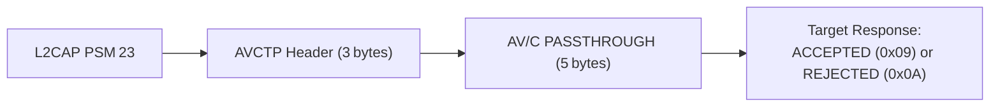

# 🔐 Bluetooth Jieli Research


[](https://github.com/SS-Sauron/Bluetooth-Jieli-Research)
[](https://docs.espressif.com/projects/esp-idf/en/stable/esp32/)
[](LICENSE)

## 📑 Table of Contents

- [Confirmed Research Findings](#-confirmed-research-findings)
- [The 8‑Byte PASSTHROUGH Frame](#-the-8‑byte-passthrough-frame)
- [Attack Matrix](#️-attack-matrix)
- [Quick Start — ESP32 AVRCP Console](#-quick-start--esp32-avrcp-console)
- [Repository Structure](#-repository-structure)
- [Documentation](#-documentation)
- [Future Work](#-future-work)
- [Disclaimer](#️-disclaimer)
- [License](#-license)
- [](https://cwe.mitre.org/data/definitions/306.html)

> **A systematic security analysis of Jieli‑based Bluetooth audio devices, revealing unauthenticated AVRCP volume injection, a proprietary JL‑SPP protocol, weak PRNG, and the definitive 8‑byte structure of the AVRCP PASSTHROUGH command.**


---

## 📊 Confirmed Research Findings

| # | Finding | CWE | Evidence |
|---|---------|-----|----------|
| 1 | **Unauthenticated AVRCP Connection** — An unpaired device can open an L2CAP connection to the earbuds on PSM 23 and receive `ACCEPTED` responses for AVRCP commands without any authentication. | CWE‑306 | `scripts/avrcp/avrcp_pause.py` |
| 2 | **Split‑Trust Boundary — Volume vs. Transport** — Volume Up/Down commands injected from an unauthenticated source are executed by the earbuds' DSP and update the phone's volume slider. Play/Pause, Next, and Previous are `ACCEPTED` at the protocol layer but silently dropped by the Android Media Session Manager when the source MAC does not match the A2DP stream owner. | CWE‑306 (Volume), CWE‑863 (Play/Pause) | `scripts/avrcp/`, `firmware/esp32_avrcp_console/` |
| 3 | **Device Self‑Terminates After Unit Info Request** — Sending a `UNIT INFO` request causes the earbuds to immediately close the L2CAP connection, suggesting the command is recognised but intentionally rejected as a defence mechanism. | CWE‑280 | `scripts/avrcp/` |
| 4 | **Proprietary JL‑SPP Service Exposed Without Authentication** — RFCOMM channels 1 and 10 accept connections without pairing. Channel 1 responds to a 4‑byte command `00 00 00 XX` with a 17‑byte payload (`01` + 16 bytes). Channel 10 accepts connections but produces no response to known probe formats. | CWE‑306 | `scripts/jl_spp/`, `data/` |
| 5 | **Full Opcode‑to‑Response Mapping on JL‑SPP Channel 1** — All 256 opcodes (0x00‑0xFF) were tested and return unique 17‑byte responses. | — | `scripts/jl_spp/jl_spp_opcode_scan.py` |
| 6 | **Timing Side‑Channel on JL‑SPP Opcodes** — Response latencies cluster into three groups: fast (~9 ms), medium (~100 ms), and slow (~300‑400 ms). | CWE‑208 | `scripts/jl_spp/jl_full_timing_scan.py` |
| 7 | **Weak PRNG with Predictable Reset** — The 16‑byte payload on channel 1 is generated by a non‑cryptographic PRNG. Opcode `0x47` forces the PRNG into a known state. | CWE‑338 | `scripts/jl_spp/jl_prng_pattern.py` |
| 8 | **Session‑Dynamic Values (No Static Identifiers)** — Repeated runs of the static‑dump script returned different values for all opcodes. No persistent device fingerprint was found via this channel. | — | `scripts/jl_spp/jl_static_dump.py` |
| 9 | **ESP32 Interactive AVRCP Console** — A full ESP‑IDF firmware implements the L2CAP→AVRCP injection chain with a scalable `command_t` table, graceful `connect`/`disconnect`/`exit`/`reboot` lifecycle, clean ACL teardown, and runtime command abort. | — | `firmware/esp32_avrcp_console/` |
| 10 | **MAC Spoofing Blocked at Baseband Layer** — Impersonating the paired phone's BD_ADDR fails when the phone is actively connected. The Bluetooth specification prohibits duplicate BD_ADDR addresses in the same piconet. | CWE‑396 | `firmware/esp32_avrcp_console/` |
| 11 | **BLE HID Media‑Key Injection** — An ESP32 paired as a Bluetooth keyboard can inject Play/Pause, Volume, Next, and Previous commands via standard HID Consumer Page usage IDs. | CWE‑287 | `scripts/ble/ble_media_keys.py` |
| 12 | **AVRCP PASSTHROUGH is Exactly 8 Bytes** — Extensive empirical testing confirms that the AVRCP PASSTHROUGH command is an 8‑byte AV/C frame over AVCTP. The 9‑byte variant is a vendor‑specific extension. | — | `docs/avrcp-technical-reference.md` |

---




## 🧬 The 8‑Byte PASSTHROUGH Frame

```
Byte:  0    1    2    3    4    5    6    7
     ┌────┬─────┬─────┬─────┬─────┬─────┬─────┬─────┐
     │AVCTP│ PID │ PID │ctype│ sub │ opc │data │state│
     │hdr  │(hi) │(lo) │0x00 │0x48 │0x7C │     │flag │
     └────┴─────┴─────┴─────┴─────┴─────┴─────┴─────┘
```

Full field‑by‑field breakdown in `docs/avrcp-technical-reference.md`.

---

## ⚔️ Attack Matrix

| Protocol | Entry Point | Auth Required | Confirmed Behaviour |
| :--- | :--- | :--- | :--- |
| Classic BR/EDR | AVRCP (PSM 23) – Python scripts | ❌ None | Volume accepted/executed. Play/Pause filtered by OS. |
| Classic BR/EDR | AVRCP (PSM 23) – ESP32 Console | ❌ None | Same as above, plus MAC spoofing attempt blocked at Baseband. |
| Classic BR/EDR | JL‑SPP (RFCOMM 1) | ❌ None | 256‑opcode response mapping, session‑dynamic values, weak PRNG. |
| Classic BR/EDR | JL‑SPP (RFCOMM 10) | ❌ None | Connection accepted, no response to probes; locked behind crypto challenge. |
| BLE | HID Keyboard | User must accept pairing | Full media control via HID Consumer Page. |

---

## 🚀 Quick Start — ESP32 AVRCP Console

```bash
cd firmware/esp32_avrcp_console
idf.py set-target esp32
idf.py menuconfig   # enable Classic BT + BT L2CAP
idf.py build
idf.py -p /dev/ttyUSB0 flash monitor
```

```
avrcp> connect
avrcp> up 5
avrcp> down 10
avrcp> exit       # abort a running batch (Ctrl+C)
avrcp> disconnect # hang up the ACL gracefully
avrcp> reboot     # force restart (Ctrl+\)
avrcp> help
```

---

## 📂 Repository Structure

```
├── firmware/
│   └── esp32_avrcp_console/     # ESP‑IDF interactive console
├── scripts/
│   ├── avrcp/                   # Python AVRCP injection
│   ├── jl_spp/                  # JL‑SPP protocol enumeration
│   ├── ble/                     # BLE media‑key injection
│   └── hid/                     # HID over Bluetooth Classic
├── docs/                        # Technical references
├── data/                        # Raw experimental data
├── paper/                       # Draft paper sections
├── ATTACK_VECTORS.md
└── README.md
```

---

## ⚠️ Disclaimer

This repository is intended solely for security research and educational purposes. All findings were obtained by testing on devices owned by the researcher. Unauthorized access to devices you do not own is illegal. A responsible disclosure process with Jieli Technology and Anker Innovations is ongoing. The authors assume no liability for misuse of the information provided herein.

---


## 📖 Citation

If you use this work in your research, please cite:

```bibtex
@misc{bluetooth-jieli-research,
  author       = {Sauron, S.S.},
  title        = {Unauthenticated Protocol Exposure and PRNG Weakness in Jieli-Based Bluetooth Audio Devices},
  year         = {2026},
  howpublished = {\url{https://github.com/SS-Sauron/Bluetooth-Jieli-Research}},
}
```


## 🎥 Demonstration

Watch the attacks in action:

[](https://www.youtube.com/watch?v=YOUR_VIDEO_ID)

## 📄 License

MIT. See `LICENSE`.
```
